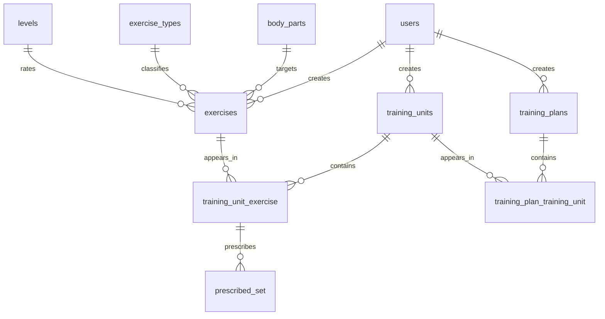

<h1 align="center">Repwise</h1>

<p align="center">
  A strength-training API and dashboard: build an exercise library, compose it into
  training units with real set-by-set prescriptions, and group those into plans.
</p>

<p align="center">
  
  
  
  
  
  
  
</p>

---

## What it does

Repwise models the way training actually gets written down.

An **exercise** is a movement, classified by the body part it targets, its type, and
its difficulty level. The app ships with a seed catalogue of **over 1,000 exercises**,
and you can add your own on top.

A **training unit** is one session: a list of exercises, each carrying an ordered
**prescription** — set 1 is 8 reps at 60 kg, set 2 is 8 at 65 kg, and so on. A
**training plan** groups units into a programme.

Everything is owned and scoped per user. You only ever see your own exercises, units
and plans, plus the shared seed catalogue.

## The interesting part of the data model

The obvious way to link units and exercises is a plain many-to-many table. That falls
apart the moment you want per-set prescriptions, because the sets belong to *this
exercise in this unit*, not to the exercise globally.

So the join is an **association object** with its own surrogate key:

```
training_units
      |
      | 1..n
      v
training_unit_exercise  ───►  exercises
      |   (unique on training_unit_id + exercise_id)
      | 1..n
      v
prescribed_set          (set_number, reps, weight)
```

`TrainingUnitExercise` carries an `id` precisely so `PrescribedSet` rows have
something to point at. Sets are ordered by `set_number` and cascade with
`delete-orphan`, so rewriting a prescription is a single assignment rather than a
manual diff.

Full entity relationships:



## How the backend is layered

```
routes/      HTTP only — validate, delegate, serialise
   |
services/    business rules, ownership checks, orchestration
   |
crud/        generic async repository over SQLAlchemy
   |
models/      declarative mappings
```

Two decisions worth knowing about if you read the code:

- **The data layer is async end to end** — `asyncpg`, `AsyncSession`, async CRUD. The
  connection pool is sized explicitly rather than left on defaults.
- **Relationships the response schema embeds use `selectin` eager loading.**
  `ExerciseInDB` nests body part, type and level as objects, so those must be loaded
  anywhere an exercise is returned. `selectin` batches them into one query per
  relationship instead of N+1. `owner` deliberately stays lazy, because responses
  expose `owner_id` only and never the user row.

## Tech stack

| Layer | Choice |
| --- | --- |
| API | FastAPI, Pydantic v2, pagination helpers |
| ORM | SQLAlchemy 2.0 (async), Alembic migrations |
| Database | PostgreSQL, `asyncpg` driver |
| Auth | JWT access and refresh tokens, `pwdlib`/bcrypt hashing, token versioning |
| Frontend | React 19, TypeScript, Vite |
| UI | Tailwind CSS v4, shadcn/ui on Radix, Zustand, Zod |
| Routing / data | TanStack Router, TanStack Query |
| API client | `openapi-fetch`, types generated from the live OpenAPI schema |
| Tests | Pytest, `pytest-cov`, a real Postgres via testcontainers |
| Tooling | mise, uv, Ruff, mypy, pre-commit |

## Getting started

You need **Docker** and [**mise**](https://mise.jdx.dev), which pins Python and uv and
runs the project tasks.

```bash
git clone https://github.com/PandyaSumit/repwise.git
cd repwise

# builds the image, starts the stack, applies migrations, seeds the exercise catalogue
mise run dev
```

Then the frontend:

```bash
cd frontend
npm install
npm run gen:api     # generate TS types from the running API schema
npm run dev
```

| Service | URL |
| --- | --- |
| Frontend | http://localhost:5173 |
| API | http://localhost:8000 |
| Swagger UI | http://localhost:8000/docs |
| Liveness / readiness | http://localhost:8000/health and `/ready` |

All API routes sit under **`/api/v1`** — for example `GET /api/v1/exercises/all`.
`/health`, `/ready` and the docs are deliberately unprefixed so probes do not depend
on the API version.

### Everyday commands

```bash
mise run up            # start the stack
mise run down          # stop it
mise run migrate       # alembic upgrade head
mise run makemigration # autogenerate a revision
mise run seed          # reseed the dev database
mise run test          # full suite against a Postgres testcontainer
mise run test-cov      # ...with coverage
mise run lint          # ruff format --check + ruff check + mypy
mise run lint-fix      # auto-format and fix
```

If you would rather not use mise, every task maps to plain Docker Compose:

```bash
docker compose up -d --build
docker compose exec app alembic upgrade head
docker compose exec app python -m scripts.seed --env=dev
```

## Configuration

Settings load from `.env.defaults`, which holds **committed dummy values for local dev
only**. Override them with a git-ignored `.env` or real environment variables.

| Group | Variables |
| --- | --- |
| App | `PROJECT_NAME`, `API_VERSION`, `SERVER_HOST`, `SERVER_PORT` |
| Security | `SECRET_KEY`, `ALGORITHM`, `ACCESS_TOKEN_EXPIRE_MINUTES`, `REFRESH_TOKEN_EXPIRE_DAYS` |
| Database | `POSTGRES_HOST`, `POSTGRES_PORT`, `POSTGRES_DB`, `POSTGRES_USER`, `POSTGRES_PASSWORD` |
| Pool | `DB_POOL_SIZE`, `DB_MAX_OVERFLOW`, `DB_POOL_RECYCLE_SECONDS` |
| Bootstrap | `FIRST_SUPERUSER_USERNAME`, `FIRST_SUPERUSER_EMAIL`, `FIRST_SUPERUSER_PASSWORD` |
| Exposure | `CORS_ORIGINS`, `ALLOWED_HOSTS` (comma-separated, `*` means any) |

The settings class refuses to start with the committed dev secret or the default
superuser password once `ENV` is anything but local, so the placeholders cannot
silently reach production.

Tests run with `ENV=test` against a testcontainer database, so the suite never touches
your dev data.

## Repository layout

```
.
├── repwise/
│   ├── api/routes/     FastAPI routers, one per resource
│   ├── services/       business rules and ownership enforcement
│   ├── crud/           generic async repository layer
│   ├── models/         SQLAlchemy declarative models
│   ├── schemas/        Pydantic request and response models
│   ├── database/       engine, session and base class
│   ├── config.py       validated settings
│   └── security.py     hashing and JWT handling
├── frontend/
│   └── src/
│       ├── features/   one folder per domain area
│       ├── api/        generated schema and typed client
│       └── components/ shared UI, shadcn primitives in ui/
├── migrations/         Alembic revisions
├── scripts/            seeding and catalogue import
├── resources/          exercises.csv, the seed catalogue
└── tests/
```

## Credits

Repwise is a fork of [gymhero](https://github.com/JakubPluta/gymhero) by
[@JakubPluta](https://github.com/JakubPluta), released under the MIT license. Thanks
for the groundwork.

## License

[MIT](LICENSE).
